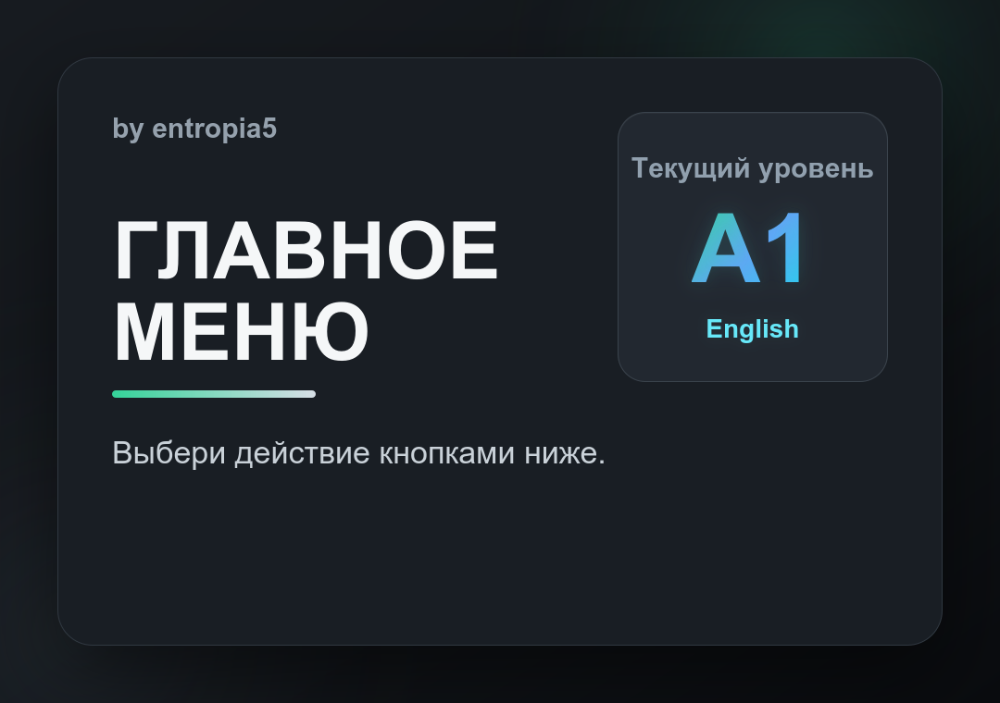
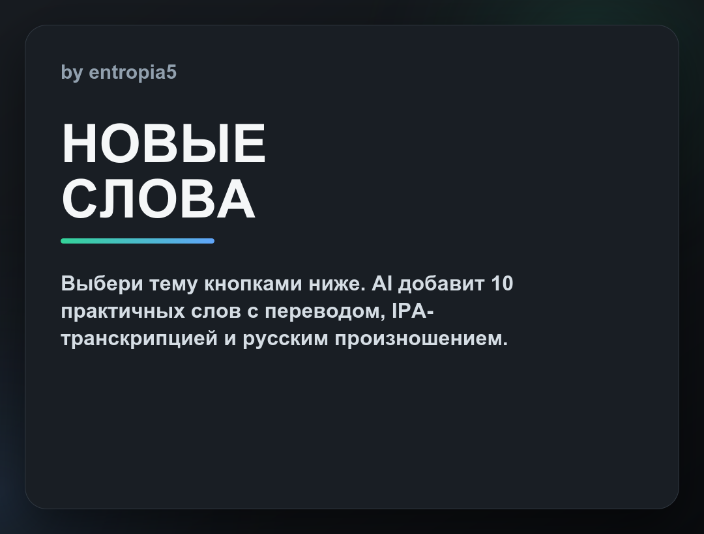
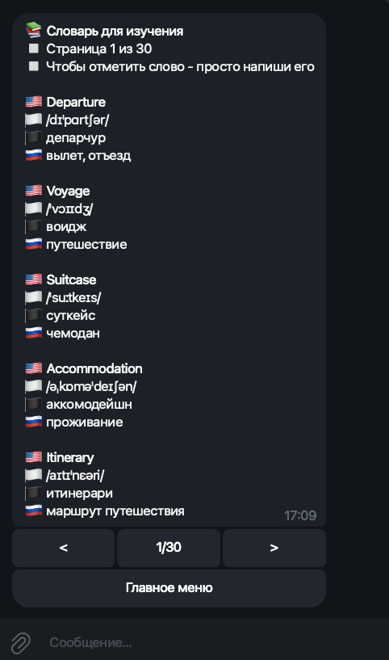
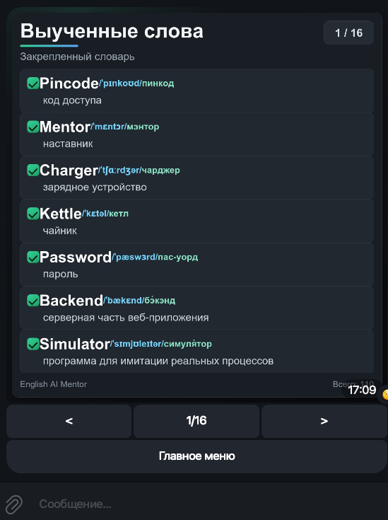
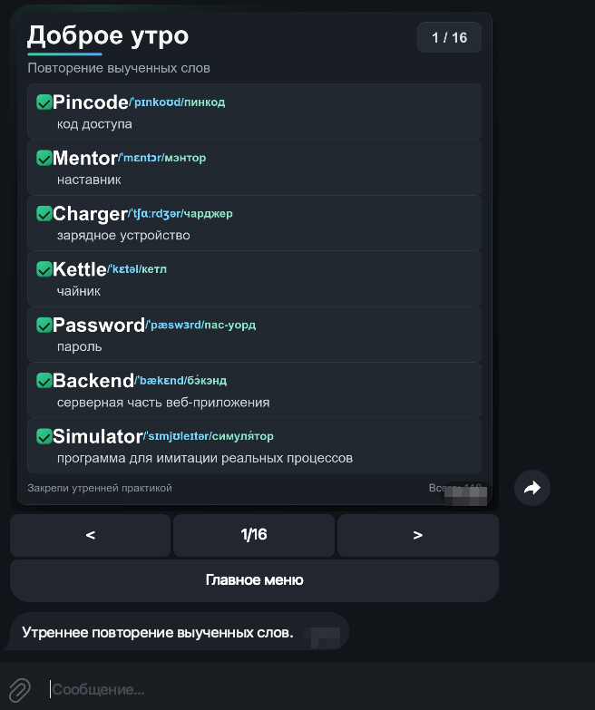
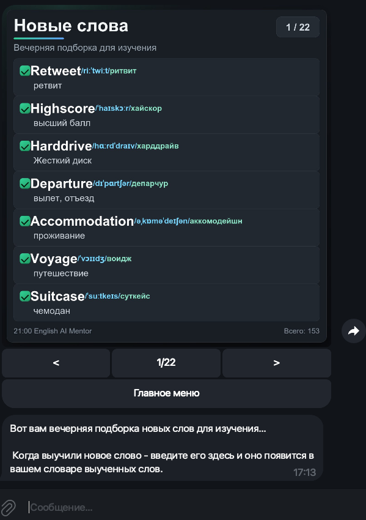

# English Mentor Bot

Telegram bot для изучения английского языка: генерирует тематические слова через AI, ведет личный словарь, помогает повторять слова утром и отвечает на вопросы по английскому.

## Что умеет

- Личный словарь для каждого пользователя.
- Генерация новых слов по темам: быт, путешествия, еда, работа, IT/C++, общение.
- Защита от дублей: одинаковые слова не добавляются повторно даже в другом регистре.
- Фильтр слабых AI-вариантов: бот отбрасывает дубли, неполные ответы, акронимы, бренды, сомнительные IT/security-слова и добирает слова из резервного словаря.
- Отметка слов как выученных одним сообщением: `word`, `Word`, `word, another word`.
- Inline-меню в один столбик без эмоджи на кнопках.
- Утренняя рассылка слов для повторения с inline-пагинацией в том же активном сообщении.
- Главное меню показывается PNG-картинкой в темно-графитовом стиле.
- Выученные слова показываются PNG-картинкой, собранной из HTML/CSS в темно-графитовом стиле.
- Утреннее повторение тоже показывается PNG-картинкой в том же стиле.
- Экран `Спросить AI` и `Статистика` тоже показываются PNG-картинками в темно-графитовом стиле.
- Экран выбора темы для новых слов тоже показывается PNG-картинкой.
- Страница выученных слов и статистика прогресса.
- Настоящая английская транскрипция и русская подсказка произношения.
- Краткое толкование смысла слова на русском под переводом.
- AI-помощник на базе Groq API.
- Ответы AI оформляются отдельным `cpp`-блоком в Telegram.
- Состояние активных экранов, временных подсказок и выполненных рассылок сохраняется в `data/state`.

## UI бота

Интерфейс в Telegram построен вокруг темно-графитовых PNG-экранов и inline-кнопок: пользователь видит один активный экран, а навигация идет через меню, пагинацию и возврат в главное меню.
Раздел `Словарь` остается текстовым Telegram-экраном для быстрого ввода слов; остальные основные экраны ниже генерируются как PNG.

| Главное меню | Новые слова |
| --- | --- |
|  |  |

| Словарь | Выученные слова |
| --- | --- |
|  |  |

| Утреннее повторение | Вечерняя подборка |
| --- | --- |
|  |  |

## Стек

- C++17
- CMake
- PostgreSQL
- libpqxx
- libcurl
- nlohmann/json
- wkhtmltoimage для рендера HTML/CSS-картинок
- Telegram Bot API
- Groq Chat Completions API

## Структура проекта

```text
include/                 # заголовочные файлы
src/
  ai/                    # клиент Groq API
  bot/                   # клиент Telegram API
  storage/               # работа с PostgreSQL
  utils/                 # конфиг и логгер
  main.cpp               # основной цикл бота, команды, рассылка
data/                    # локальные данные и серверный кэш PNG-картинок
build/                   # директория сборки
```

## Настройка

1. Установите зависимости:

```bash
sudo apt-get update
sudo apt-get install libpqxx-dev libcurl4-openssl-dev nlohmann-json3-dev wkhtmltopdf cmake build-essential
```

2. Создайте PostgreSQL-базу:

```bash
createdb english_mentor
```

3. Скопируйте пример окружения:

```bash
cp .env.example .env
```

4. Заполните `.env`:

```env
TELEGRAM_TOKEN=YOUR_TELEGRAM_BOT_TOKEN
GROQ_API_KEY=YOUR_GROQ_API_KEY
GROQ_MODEL=llama-3.3-70b-versatile
GROQ_MAX_TOKENS=1800

DB_HOST=localhost
DB_PORT=5432
DB_NAME=english_mentor
DB_USER=n8n
DB_PASSWORD=YOUR_DB_PASSWORD

ALLOWED_USERS=123456789,987654321
USER_1_ID=123456789
```

Токен Telegram можно получить через BotFather. Ключ Groq нужен для генерации слов и AI-ответов.

## Сборка

```bash
mkdir -p build
cd build
cmake ..
cmake --build .
```

После сборки появится бинарник:

```text
build/english_mentor
```

## Запуск

Из директории `build`:

```bash
./english_mentor
```

Или из корня проекта:

```bash
cd build
./english_mentor
```

При первом запуске бот создаст нужные таблицы и индексы в PostgreSQL.

## Перезапуск после изменений

Пересоберите проект:

```bash
cd /path/to/cxx_english_mentor_v2
cmake --build build
```

Если бот запущен в терминале, остановите его через `Ctrl+C` и запустите снова:

```bash
cd build
./english_mentor
```

Если бот запущен в фоне:

```bash
pgrep -af english_mentor
kill PID
cd build
./english_mentor
```

## Основные команды в Telegram

- `/start` или `start` - открыть inline-меню; команда удаляется из чата после выполнения.
- Кнопка `Словарь` - показать невыученные слова.
- Кнопка `Выученные` - показать выученные слова картинкой с пагинацией `< 1/100 >`.
- Кнопка `Новые слова` - выбрать тему и сгенерировать новые слова.
- Кнопка `Статистика` - показать прогресс.
- Любой вопрос текстом - спросить AI; ответ редактирует активный экран бота, а текст вопроса удаляется из чата после ответа.

## Картинки слов

PNG-картинка главного меню хранится на сервере в:

```text
data/rendered/menu/main_menu_<level>.png
```

PNG-картинки выученных слов хранятся на сервере в:

```text
data/rendered/learned/<telegram_chat_id>/page_N.png
```

PNG-картинки утреннего повторения хранятся на сервере в:

```text
data/rendered/daily/<telegram_chat_id>/page_N.png
```

PNG-картинки вечерней подборки новых слов хранятся на сервере в:

```text
data/rendered/evening/<telegram_chat_id>/page_N.png
```

PNG-картинка экрана AI хранится в:

```text
data/rendered/ai/prompt.png
```

PNG-картинки статистики кэшируются по значениям прогресса в:

```text
data/rendered/stats/<telegram_chat_id>/stats.png
```

PNG-картинка выбора темы хранится в:

```text
data/rendered/topics/topic_menu.png
```

Служебные экраны статусов, например генерация слов или пустое утреннее повторение, хранятся в:

```text
data/rendered/status/<status_key>.png
```

Для каждой страницы используется постоянное имя файла. Рядом хранится `page_N.hash`: если слова на странице не изменились, бот переиспользует готовую картинку; если изменились, перезаписывает тот же PNG, а не создает копии.
Если количество страниц стало меньше, устаревшие `page_N.png`, `page_N.html` и `page_N.hash` удаляются автоматически.

Можно безопасно убрать временные и legacy-артефакты рендера без запуска Telegram polling:

```bash
./build/english_mentor --cleanup-render-cache
```

Быстрые встроенные проверки чистых функций запускаются без `.env` и без Telegram:

```bash
./build/english_mentor --self-test
```

Скриншоты README можно пересобрать из текущего рендера и данных пользователя:

```bash
./build/english_mentor --refresh-doc-screenshots
./build/english_mentor --refresh-doc-screenshots <telegram_chat_id>
```

## Чистка дублей

При старте бот удаляет дубли слов по ключу `user_id + lower(trim(english))` и создает уникальный индекс, чтобы новые дубли не попадали в таблицу.

Можно выполнить только чистку БД без запуска Telegram polling:

```bash
./build/english_mentor --cleanup-db
```

Можно посмотреть слабые старые слова, которые больше не проходят текущий фильтр генерации:

```bash
./build/english_mentor --audit-words
```

Можно удалить такие слова из БД по точным `id`:

```bash
./build/english_mentor --cleanup-bad-words
```

Можно один раз заполнить английскую IPA-транскрипцию и русскую подсказку произношения для старых слов, где эти поля пустые:

```bash
./build/english_mentor --backfill-transcriptions
```

Можно один раз заполнить краткие толкования смысла для старых слов:

```bash
./build/english_mentor --backfill-definitions
```

Чтобы отметить слова как выученные, отправьте одно слово или список через запятую:

```text
house
House
house, travel, meeting
```

## Как устроены слова

Каждое слово хранится с такими данными:

- английское слово;
- перевод на русский;
- краткое толкование смысла на русском;
- настоящая транскрипция, например `/haʊs/`;
- русская подсказка произношения;
- тема;
- статус выучено/не выучено.

В PNG-картинках слово отображается примерно так:

```text
[✓] house  /haʊs/  хаус
    дом
    здание или место, где живут люди
```

## Рассылки

Планировщик работает по локальному времени сервера:

- около `09:00` показывает повторение из уже выученных слов;
- около `21:00` генерирует 10 новых слов и показывает вечернюю подборку.

Если у пользователя уже есть активный экран бота, он редактируется; если нет, бот создает новый inline-экран. Оба экрана показываются PNG-картинкой с inline-пагинацией вида `< 1/100 >`.

После утренней и вечерней рассылки бот отправляет короткую временную подсказку под экраном. Она удаляется автоматически через 15 минут или сразу после нажатия любой inline-кнопки.

Если утром у пользователя нет выученных слов, бот показывает отдельный экран без временной подсказки. Такая рассылка считается обработанной на сегодня, чтобы не повторяться каждую минуту. Если Telegram/API реально не принял экран или подсказку, день не помечается как отправленный, и планировщик сможет повторить попытку в текущем временном окне.

Факты успешных рассылок хранятся в:

```text
data/state/broadcast_runs.json
```

Для ручной проверки пользователь из `.env` `USER_1_ID` может отправить текстовые команды:

```text
testing
testing_evening
```

Тот же вечерний сценарий можно запустить с сервера без ожидания 21:00:

```bash
./build/english_mentor --send-evening-once
./build/english_mentor --send-evening-once <telegram_chat_id>
```

Список пользователей для рассылки берется из `.env` `ALLOWED_USERS`. Если он пустой, бот пробует `USER_1_ID`, `USER_2_ID` и так далее.

## База данных

Таблицы создаются автоматически:

- `users`
- `words`
- `conversations`

Для слов создаются индексы по пользователю, статусу изучения, дате повторения и регистронезависимому английскому слову.

## Логи

Логи пишутся в файл:

```text
build/bot.log
```

По логам удобно смотреть:

- ответы Groq;
- сколько слов удалось распарсить;
- какие слова пропущены как дубли;
- отправку сообщений Telegram;
- ошибки API или базы.
