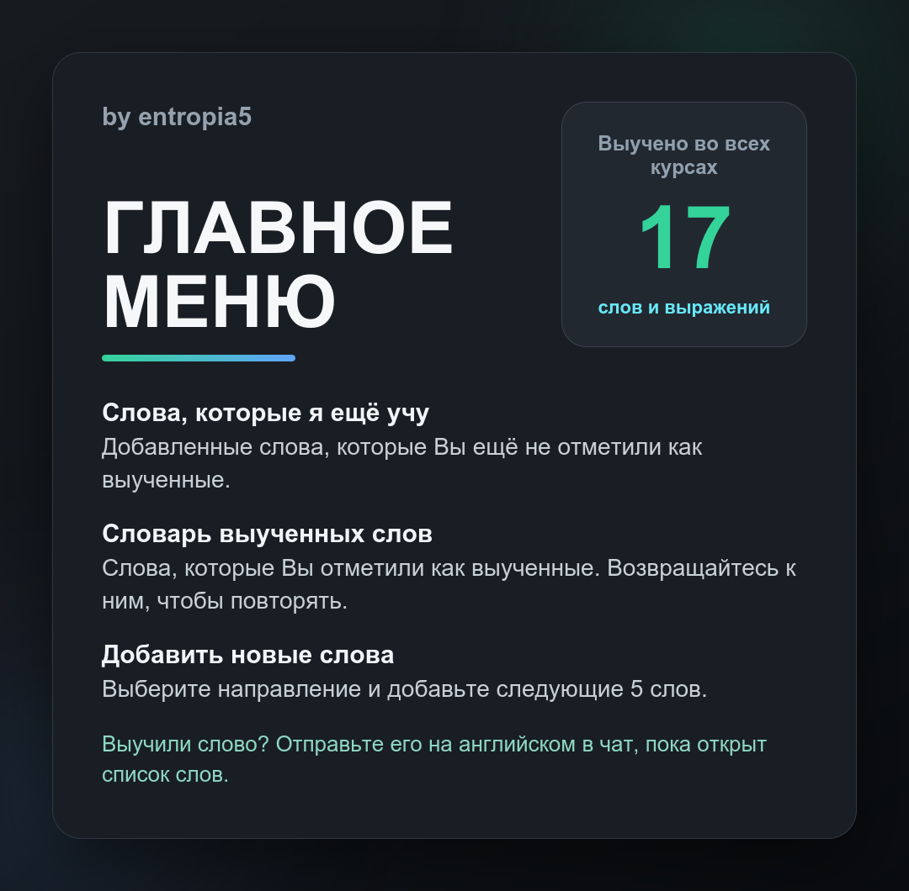
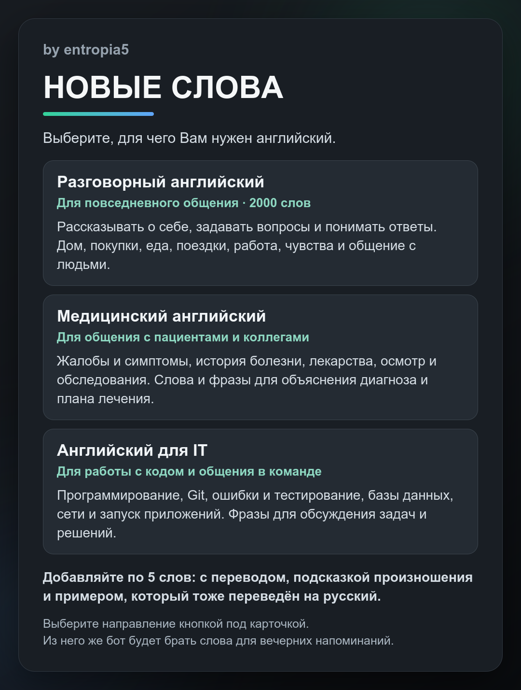
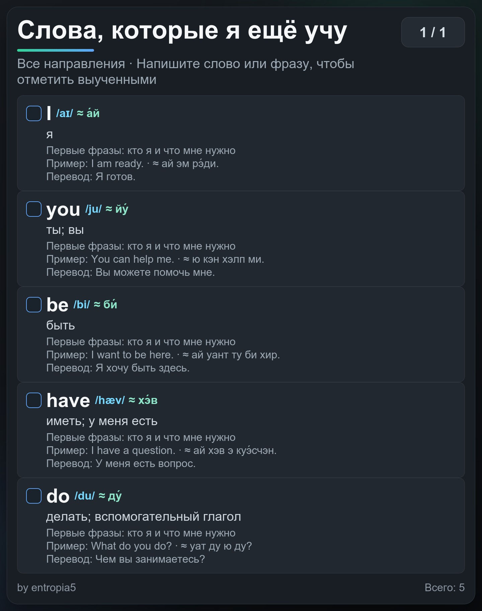
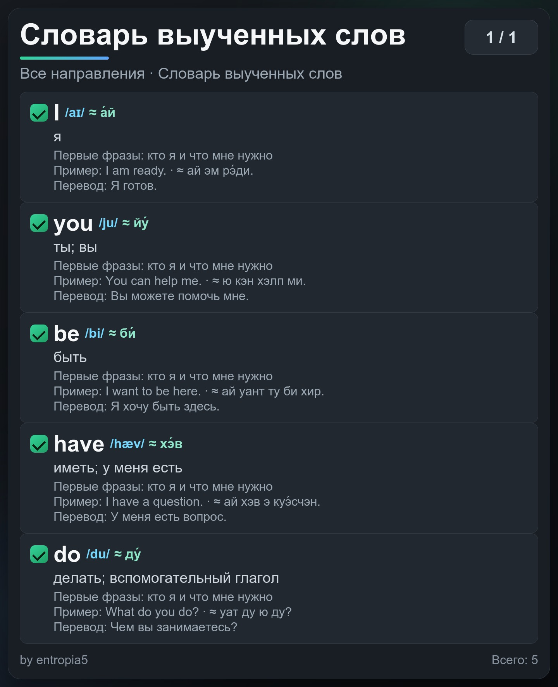
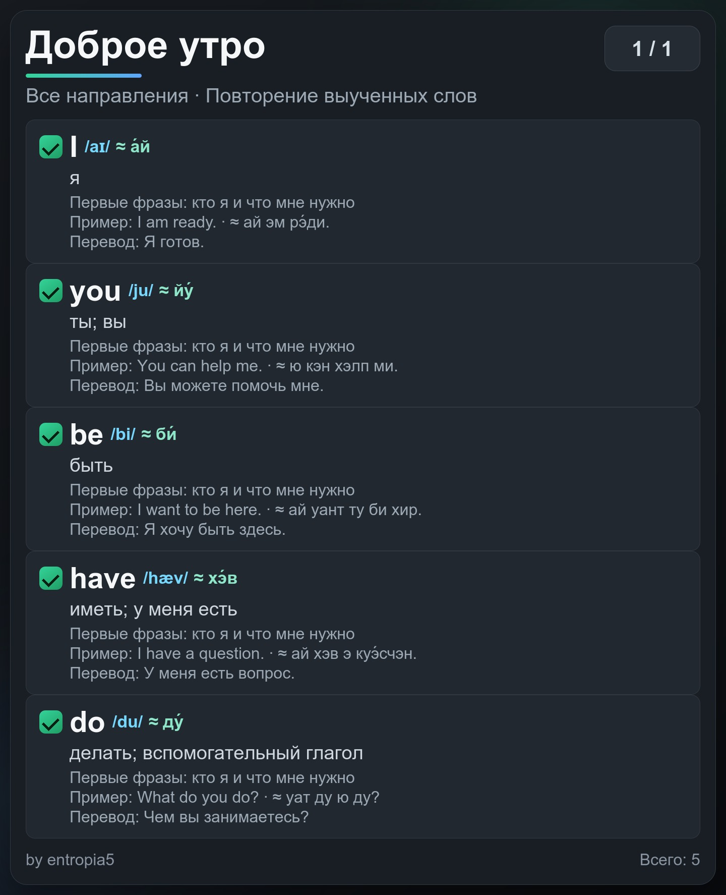
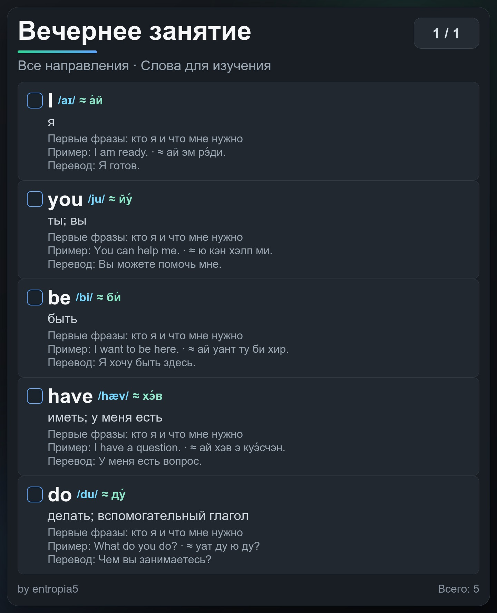

# English AI Mentor Bot

[](https://github.com/entropia5/english-ai-mentor-bot/actions/workflows/ci.yml)
[](https://isocpp.org/)
[](https://cmake.org/)
[](https://www.postgresql.org/)
[](LICENSE)

Модульный Telegram-бот на C++17 для изучения английского языка. Он выдаёт слова из трёх учебных каталогов, использует Groq AI для объяснений и
разговорной практики, ведёт личный словарь, организует утренние
повторения и вечерние занятия и отображает интерфейс как HTML/CSS → PNG-экраны.

Главная инженерная особенность проекта — разделение доменной логики, Telegram,
PostgreSQL, AI, presentation и rendering. Внешний вид экранов меняется через
runtime-шаблоны и CSS **без перекомпиляции C++**.

## Интерфейс

| Главное меню | Выбор темы |
|:---:|:---:|
|  |  |

| Слова, которые я ещё учу | Словарь выученных слов |
|:---:|:---:|
|  |  |

| Утреннее повторение | Вечерняя подборка |
|:---:|:---:|
|  |  |

Карточки ниже созданы штатным renderer на демонстрационных данных без данных пользователей.
Предпросмотр можно создать командой:

```bash
./build/dev/english_mentor --render-preview
```

## Возможности

- личный словарь и независимый прогресс каждого пользователя;
- три курса: разговорный английский (2000 слов), медицинский английский (300 позиций), IT (282 позиции);
- транскрипция, приблизительная русская подсказка произношения, перевод и короткий пример;
- последовательное добавление по 5 слов, отдельный прогресс направлений и защита от дублей;
- отметка одного или нескольких слов как выученных обычным сообщением;
- PNG-интерфейс с inline-навигацией и пагинацией;
- редактирование одного активного Telegram-сообщения вместо засорения чата;
- утренние повторения и вечерние подборки с защитой от повторной рассылки;
- AI-помощник и короткие диалоги с изучаемыми словами и историей переписки;
- автоматические SQL-миграции и сохранение runtime-состояния;
- preview, self-test, maintenance-команды, unit-тесты и sanitizer-сборка.

Состав, принципы отбора, источники произношения и ограничения описаны в
[документации курсов](resources/courses/README.md). Добавление слов работает без AI API.
В словаре и выученных словах есть переключатель «Все / Разговорный / Медицинский / IT».
В главном меню → «Напоминания» отдельно выбираются направление и включение утра и вечера.
Эти настройки сохраняются и не меняются при добавлении слов. Прогресс словаря
не выдаётся за уровень CEFR.

## Технологии

- C++17, CMake и CTest;
- Telegram Bot API и libcurl;
- Groq Chat Completions API;
- PostgreSQL и libpqxx;
- nlohmann/json;
- HTML/CSS и `wkhtmltoimage`;
- Docker Compose;
- GitHub Actions, clang-format, clang-tidy, ASan и UBSan.

## Архитектура

```text
Telegram update
      │
      ▼
┌───────────────────┐
│ Application layer │  polling, CLI, routing
└─────────┬─────────┘
          │
    ┌─────┴──────────────┐
    ▼                    ▼
┌──────────┐      ┌──────────────┐
│ Services │      │ Presentation │
└────┬─────┘      └──────┬───────┘
     │                   │
 ┌───┴────┐         ┌────┴─────┐
 ▼        ▼         ▼          ▼
Domain  Storage  Rendering  Telegram API
          │          │
      PostgreSQL  HTML/CSS → PNG
```

Основная логика собирается в статическую библиотеку `english_mentor_core`.
Исполняемый файл является composition root, а тесты используют ту же библиотеку.

| Модуль | Ответственность |
|---|---|
| `domain` | Модели слов без Telegram и БД |
| `app` | CLI, polling loop, маршрутизация сообщений и callback-запросов |
| `services` | Учебные каталоги, словари, рассылки, аудит и обслуживание |
| `presentation` | Экраны, пагинация, UI-сессии и доставка сообщений |
| `rendering` | HTML-шаблоны, CSS, PNG-рендер и кэш |
| `bot` | Telegram API, keyboards, JSON/multipart transport |
| `ai` | Groq client и разбор структурированных AI-ответов |
| `storage` | PostgreSQL, миграции и файловые checkpoints |
| `scheduler` | RAII-владение worker-потоком и плановые задачи |
| `core` | Общие переиспользуемые операции |

Более подробные границы и потоки данных описаны в
[ARCHITECTURE.md](ARCHITECTURE.md), правила разработки — в
[CONTRIBUTING.md](CONTRIBUTING.md).

## Структура проекта

```text
.
├── include/                    # публичные интерфейсы модулей
│   ├── ai/
│   ├── app/
│   ├── core/
│   ├── domain/
│   ├── presentation/
│   ├── rendering/
│   ├── scheduler/
│   ├── services/
│   └── storage/
├── src/                        # реализации модулей
│   ├── ai/
│   ├── app/
│   ├── bot/
│   ├── core/
│   ├── domain/
│   ├── presentation/
│   ├── rendering/
│   ├── scheduler/
│   ├── services/
│   ├── storage/
│   └── utils/
├── resources/
│   ├── fallback_words.json
│   └── rendering/
│       ├── styles/             # runtime CSS-модули
│       └── templates/          # runtime HTML-шаблоны
├── migrations/                 # последовательные SQL-миграции
├── tests/                      # unit-тесты
├── docs/ui/                    # скриншоты для README
├── .github/workflows/          # CI
├── CMakePresets.json
├── Dockerfile
└── compose.yaml
```

## Быстрый старт

### 1. Зависимости

Для Debian/Ubuntu:

```bash
sudo apt-get update
sudo apt-get install \
  build-essential cmake \
  libpqxx-dev libcurl4-openssl-dev nlohmann-json3-dev \
  wkhtmltopdf postgresql
```

Требуется CMake 3.25 или новее.

### 2. Конфигурация

```bash
createdb english_mentor
cp .env.example .env
```

Заполните `.env`:

```env
TELEGRAM_TOKEN=YOUR_TELEGRAM_BOT_TOKEN
GROQ_API_KEY=YOUR_GROQ_API_KEY
GROQ_MODEL=llama-3.3-70b-versatile
GROQ_MAX_TOKENS=1800

DB_HOST=localhost
DB_PORT=5432
DB_NAME=english_mentor
DB_USER=mentor
DB_PASSWORD=YOUR_DB_PASSWORD

ALLOWED_USERS=123456789
USER_1_ID=123456789
```

Telegram-токен создаётся через BotFather. Секреты из `.env` не должны попадать в Git.

### 3. Сборка и тесты

```bash
cmake --preset dev
cmake --build --preset dev
ctest --preset dev
```

### 4. Проверка и запуск

```bash
./build/dev/english_mentor --self-test
./build/dev/english_mentor --render-preview
./build/dev/english_mentor
```

При первом запуске бот применит миграции и создаст необходимые таблицы и индексы.
Preview-изображения появятся в `data/rendered/`.

## Docker Compose

```bash
cp .env.example .env
# Заполните TELEGRAM_TOKEN, GROQ_API_KEY и DB_PASSWORD
docker compose up --build -d
docker compose logs -f bot
```

Compose запускает PostgreSQL с healthcheck и bot в отдельной сети. Runtime image
не содержит компилятор, процесс работает от непривилегированного пользователя,
а `resources/rendering` подключается read-only для изменения темы с host-машины.

Остановка:

```bash
docker compose down
```

Удаление volumes и локальной базы:

```bash
docker compose down --volumes
```

> Последняя команда безвозвратно удаляет данные PostgreSQL из Docker volume.

## Дизайн без перекомпиляции

Rendering-слой читает ресурсы при создании изображения:

```text
resources/rendering/
├── styles/
│   ├── 00_tokens.css   # цвета, шрифты, радиусы, design tokens
│   ├── 10_base.css     # canvas, panels и общие компоненты
│   ├── 20_compact.css  # компактные и status-экраны
│   ├── 30_menu.css     # главное меню
│   ├── 40_stats.css    # статистика и progress bar
│   └── 50_words.css    # карточки слов
└── templates/
    ├── word_item.html  # отдельная карточка слова
    └── ...             # шаблоны экранов
```

Чтобы изменить визуальный стиль:

1. отредактируйте CSS или HTML;
2. запустите `./build/dev/english_mentor --render-preview`;
3. проверьте результат в `data/rendered/`.

Перекомпиляция не нужна. Содержимое runtime-ресурсов участвует в hash кэша:
после изменения стиля устаревший PNG автоматически перерендерится. CSS-файлы
подключаются в лексикографическом порядке, поэтому числовой префикс управляет
каскадом.

Другую тему можно подключить без изменения исходников:

```env
RENDER_RESOURCES_DIR=/absolute/path/to/rendering
```

## Проверка качества

Dev preset включает строгие предупреждения и рассматривает их как ошибки:

```bash
cmake --preset dev
cmake --build --preset dev
ctest --preset dev
```

Проверка AddressSanitizer и UndefinedBehaviorSanitizer:

```bash
cmake --preset sanitize
cmake --build --preset sanitize
ctest --preset sanitize
```

CI дополнительно проверяет форматирование, clang-tidy и Docker image.
Unit-тестам не нужны Telegram, Groq или запущенный PostgreSQL.

## Основные команды бота

- `/start` или `start` — открыть главное меню;
- `Слова, которые я ещё учу` — показать новые слова;
- `Словарь выученных слов` — открыть выученные слова;
- `Добавить новые слова` — выбрать тему и создать подборку;
- `Статистика` — показать текущий прогресс;
- «Спросить AI» — включить диалог с помощником; «Главное меню» — выйти из него;
- вне режима AI сообщения используются для отметки слов и не отправляются помощнику;
- `house travel meeting`, `house, travel, meeting` или слова с новой строки — отметить их как выученные в выбранном словаре; словосочетания распознаются целиком.

Планировщик использует локальное время сервера:

- около `09:00` — повторение выученных слов выбранного направления;
- около `21:00` — повторение добавленных неизученных слов либо добавление до 5 новых
  (режим выбирается в «Напоминаниях»; по умолчанию сохраняется добавление новых).

Утро и вечер можно независимо выключать и включать. Вечер использует направление,
выбранное при ручном добавлении слов; отдельного выбора направления для вечера нет.
Утром «Повторять все слова» охватывает выученные слова всех направлений.
Пустые подборки не отправляются.

Каждое утреннее и вечернее напоминание приходит новым сообщением с карточкой и короткой
подписью. Кнопки обновляют эту карточку. Вечером в режиме добавления карточка содержит
только новые слова дня; в режиме повторения — ранее добавленные неизученные слова.
Уведомление зависит от настроек чата в Telegram.

Вечерняя подборка сохраняется в базе вместе с добавленными словами. Повторная попытка
отправки, в том числе после перезапуска, использует ту же подборку за день и не добавляет
ещё пять слов.

Успешные рассылки фиксируются в `data/state/broadcast_runs.json`, поэтому одна и та
же задача не отправляется повторно в течение дня.

Главный пользователь (`USER_1_ID`) может проверить напоминания в личном чате:

- `/testing` — утреннее повторение;
- `/testing_evening` — вечерняя подборка по текущим настройкам.

Вечерняя проверка действительно добавляет слова, если включён этот режим. Повторная
проверка в тот же день использует сохранённую подборку. Отключённые напоминания
и пустые подборки не отправляются.

## Служебные CLI-команды

Все команды выполняются без запуска Telegram polling:

```bash
./build/dev/english_mentor --self-test
./build/dev/english_mentor --render-preview
./build/dev/english_mentor --refresh-doc-screenshots <chat_id>
./build/dev/english_mentor --cleanup-render-cache
./build/dev/english_mentor --cleanup-db
./build/dev/english_mentor --audit-words
./build/dev/english_mentor --cleanup-bad-words
./build/dev/english_mentor --backfill-transcriptions
./build/dev/english_mentor --backfill-definitions
./build/dev/english_mentor --send-evening-once <chat_id>
```

## Runtime-данные

```text
data/
├── rendered/            # PNG, HTML и hash-кэш
├── state/
│   ├── bot_state.json
│   ├── broadcast_runs.json
│   └── telegram_update_state.json
└── fallback_words.json # необязательный локальный override
```

`data/`, `.env`, логи и build-артефакты исключены из Git. Резервный словарь,
который входит в репозиторий, находится в `resources/fallback_words.json`.

## Лицензия

Проект распространяется по лицензии [MIT](LICENSE).

## Проверка курсов и полный сброс словарей

Интеграционные проверки создают отдельную временную БД, затем удаляют её:

```sh
python3 tools/test_courses_database.py --container postgres_n8n --config .env
```

Полный сброс — отдельная административная операция, не миграция при старте.
Предварительно остановите все экземпляры бота и планировщики, пишущие в эту БД.
Команда сохраняет приватную полную копию БД и проверяет восстановление во временную
базу, затем удаляет все слова, включая выученные, и сбрасывает связанный прогресс.
Учётные записи и переписки сохраняются. Контейнер должен обслуживать именно БД
из указанного `.env`; имя контейнера ниже относится к локальной установке.

```sh
python3 tools/reset_vocabulary.py --container postgres_n8n --config .env \
  --binary build/courses/english_mentor --confirm-all-users
```

Резервная копия и отчёт о количестве записей сохраняются в `data/backups/`.
Для восстановления сначала остановите бот, восстановите dump в отдельную БД через
`pg_restore --no-owner --no-acl`, проверьте данные и переключите конфигурацию на неё.
Не восстанавливайте архив поверх работающей БД без отдельного плана отката.

### Быстрая передача карточек и очистка кеша

Карточки создаются в JPEG с качеством 92 и прежними размерами; если JPEG не удалось
создать, рендерер пробует PNG. HTML-шаблоны и размеры шрифтов не меняются.
Ключ кеша рендеринга обновлён: старые PNG заменяются при открытии экрана.

После успешной загрузки бот запоминает Telegram `file_id` по SHA-256 содержимого.
Повторная отправка или редактирование использует эту ссылку, сохраняя актуальные
подпись и кнопки. Изменённая картинка загружается заново. Отказ Telegram именно
из-за `file_id` вызывает одну повторную загрузку файла; сетевые ошибки и 429
не вызывают повторную отправку, чтобы не создавать дубли.

Кеш `file_id` хранится только в памяти конкретного клиента бота: не более 256
записей, вытеснение давно использованных; записи без обращений 24 часа удаляются
при следующем обращении к кешу. Перезапуск очищает этот небольшой кеш полностью.
Он не записывает токен бота или ссылки Telegram на диск.

Планировщик проверяет `data/rendered` при запуске и затем раз в час:

- удаляет наборы файлов карточек, не использовавшиеся 7 дней;
- при объёме свыше 256 МиБ удаляет наиболее старые наборы;
- сохраняет использовавшиеся в последний час файлы, поэтому лимит размера мягкий;
- удаляет только `.html`, `.hash`, `.png`, `.jpg` внутри каталога рендеринга,
  не переходит по символическим ссылкам и не трогает словари, прогресс и настройки.

Повторное использование карточки обновляет время её `.hash`. Отрисовка и очистка
синхронизированы. Удалённая карточка будет создана заново при следующем открытии.

### Скачивание словаря в PDF

Кнопка «Скачать словарь в PDF» в главном меню открывает карточку в общем стиле
бота с описанием двух вариантов и кнопками выбора:

- «Все 2000 разговорных слов» — полный готовый каталог, независимо от прогресса,
  в порядке курса, с переводом, транскрипцией, произношением и примерами.
  Файл `conversation-2000.pdf`; личный словарь и прогресс не изменяются.
- «Только выученные слова» — все выученные слова пользователя из всех направлений
  по алфавиту, с сохранёнными пояснениями и примерами. Текущий фильтр не влияет
  на выгрузку. Файл `learned-dictionary.pdf`.

Документы оформлены для печати на A4. Сообщение с PDF остаётся до следующего
нажатия кнопки/текстового действия или успешной отправки утреннего/вечернего
напоминания, затем бот удаляет его. Таймер короткого сообщения «Готово» на PDF
не действует. Скачивание вложения средствами Telegram само по себе не удаляет
сообщение. Сохранённый на устройстве файл остаётся у пользователя.
Идентификаторы PDF сохраняются между перезапусками; неудачное удаление повторяется
при следующем действии. Пустой словарь и ошибки показываются подсказкой, которая
также удаляется при следующем действии.

На сервере нужны `wkhtmltopdf`, `timeout` и шрифт DejaVu Sans с кириллицей.
Генерация ограничена 45 секундами; временные HTML/PDF удаляются после отправки
или ошибки. При каждом выборе создаётся актуальная выгрузка.
